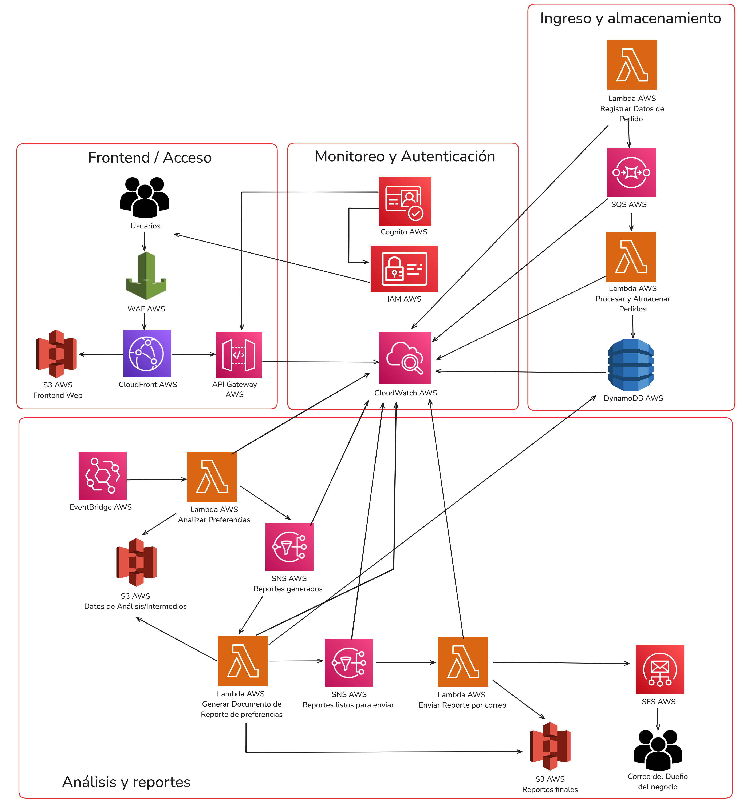

# Infraestructura para ReyGasExpress

## 1. Integrantes:
- Ruiz Sanchez Fabricio Augusto.
- Vilchez Zavaleta Edwin Valentino.

## 2. Descripción del Proyecto:

**ReyGasExpress** es un sistema integral diseñado para optimizar la gestión de pedidos de "REY GAS EXPRESS", una empresa distribuidora de gas y agua en Trujillo. La plataforma centraliza el registro eficiente de pedidos, capturando detalles cruciales como la ubicación del cliente y las marcas específicas solicitadas de gas y agua.

La funcionalidad clave de **ReyGasExpress** radica en su capacidad para analizar las preferencias de marca por sector geográfico dentro de la ciudad de Trujillo. Al identificar las marcas de gas y agua con mayor demanda en cada zona, el sistema proporciona información valiosa para la optimización de inventarios y la anticipación de la demanda por marca en cada sector.

El objetivo final de **ReyGasExpress** es mejorar significativamente la eficiencia operativa de "REY GAS EXPRESS" y aumentar la satisfacción del cliente, asegurando la disponibilidad de las marcas preferidas en cada área de Trujillo. Adicionalmente, el sistema facilitará la gestión de los pedidos diarios a los proveedores, basándose en la demanda anticipada.

La arquitectura de la plataforma se está desarrollando con un enfoque en la escalabilidad, la seguridad y el bajo mantenimiento.

## 3. Servicios AWS Utilizados:

Este proyecto utiliza los siguientes servicios de Amazon Web Services (AWS) para construir una infraestructura robusta y escalable:
- **WAF AWS:** Protege las aplicaciones web de exploits web comunes que podrían afectar la disponibilidad, comprometer la seguridad o consumir recursos excesivos, filtrando el tráfico web malicioso.
- **CloudFront AWS:** Es una red de entrega de contenido (CDN) que distribuye contenido estático (archivos web, imágenes) y dinámico con baja latencia y alta velocidad a usuarios en todo el mundo.
- **S3 AWS:** Es un servicio de almacenamiento de objetos escalable, duradero y de alta disponibilidad, ideal para almacenar cualquier tipo de archivo.
- **API Gateway AWS:** Es un servicio que permite a los desarrolladores crear, publicar, mantener, monitorear y proteger APIs a cualquier escala. Actúa como el "front door" para las solicitudes a los servicios de backend.
- **Lambda AWS:** Es un servicio de computación sin servidor que permite ejecutar código sin aprovisionar o gestionar servidores, escalando automáticamente en respuesta a eventos.
- **Cognito AWS:** Es un servicio de identidad para aplicaciones web y móviles que permite gestionar de forma segura el registro, inicio de sesión y control de acceso de usuarios.
- **IAM AWS:** Permite gestionar de forma segura el acceso a los servicios y recursos de AWS, controlando quién está autenticado y autorizado para usar qué recursos.
- **CloudWatch AWS:** Es un servicio de monitoreo y observabilidad que recopila datos operativos y de monitoreo en forma de logs, métricas y eventos de los servicios de AWS.
- **DynamoDB AWS:** Es un servicio de base de datos NoSQL rápido y flexible, completamente administrado, diseñado para aplicaciones que necesitan baja latencia y alta escalabilidad.
- **SQS AWS:** Es un servicio de cola de mensajes completamente administrado que permite desacoplar y escalar microservicios y aplicaciones distribuidas.
- **SNS AWS:** Es un servicio de mensajería de publicación/suscripción (pub/sub) completamente administrado, que permite enviar mensajes a múltiples suscriptores de forma simultánea.
- **EventBridge AWS:** Es un servicio de bus de eventos sin servidor que facilita la conexión de aplicaciones con datos de varias fuentes y permite establecer reglas para responder a eventos en tiempo real o programar eventos.
- **SES AWS:** Un servicio de envío de correo electrónico flexible, escalable y rentable, diseñado para que los desarrolladores envíen correos electrónicos desde sus aplicaciones.

## 4. Diagrama de arquitectura:
